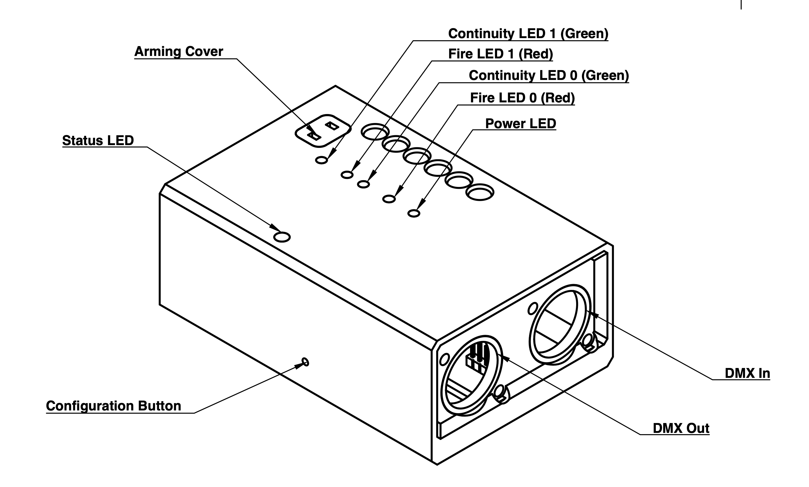
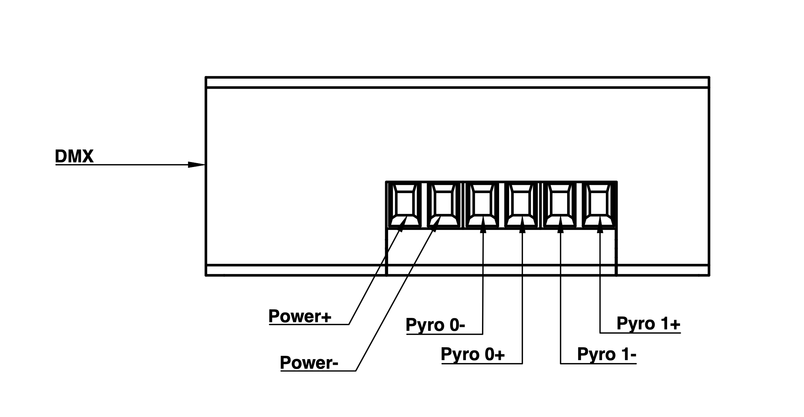
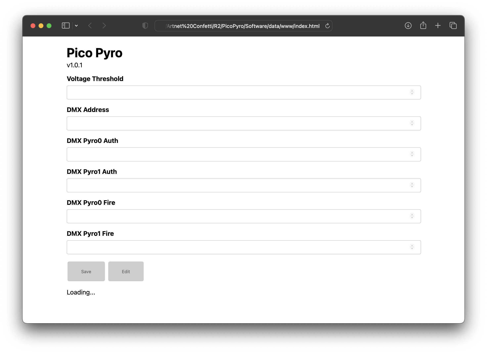

# Pico Pyro v1.0.1
DMX controlled dual pyrotechnic channels.

## Hardware Overview

 - Status LED - (WHITE, GREEN, RED, BLUE, PURPLE)
 - Continuity LED - (GREEN)
 - Fire LED - (RED)
 - Configuration Button
 - Arming Cover

 - Power+ (3v-50v)
 - Power-
 - Pyro 0-
 - Pyro 0+
 - Pyro 1-
 - Pyro 1+

## Modes
The Pico Pyro can be in one of three modes, these are indicated by the status LED.

By default the system enters **active** mode when turned on.

To enter **setup** mode the configuration button must be pressed while being turned on. Setup mode cannot be entered after booting.

If the system detects an invalid configuration during boot the system will enter **failed** mode. To resolved the system must be turned off and back on into setup mode.

### Active
 - Status LED is solid **GREEN** when DMX is detected, **RED** when no DMX signal is detected.
 - Continuity LEDs are **GREEN** when the voltage threshold is met across the pyrotechnic channels. These are used to show if there is a good connection across the hardware connected.
 - Fire LEDs are **RED** when the specified pyrotechnic channel is fired. This occurs when the DMX authorization and fire values are met for that channel.

### Setup
 - Status LED **BLUE**.
 - Continuity LEDs are **GREEN** when the voltage threshold is met across the pyrotechnic channels. These are used to show if there is a good connection across the hardware connected.
 - Fire LEDs and hence pyrotechnic channels off and cannot activate.

### Failed
 - Status LED **PURPLE**.
 - Continuity LEDs off and cannot activate.
 - Fire LEDs and hence pyrotechnic channels off and cannot activate.

## Usage Tips
Ensure all connections are attached.  
Arming cover can be removed for rehearsals to test the behaviour of the system without activating pyrotechnic channels.

When the arming cover is removed the channels are electrically disconnected and cannot fire. The continuity LEDs will temporarily stop working. Fire LEDs will work as expected but won't fire the pyrotechnic channels.

The recommended method of removing the arming cover is by placing a cable tie through the loop and pulling backwards.

## DMX

| Channel | Description                         |
| ------- | ----------------------------------- |
| 1       | Pyrotechnic Channel 0 Authorization |
| 2       | Pyrotechnic Channel 1 Authorization |
| 3       | Pyrotechnic Channel 0 Fire          |
| 4       | Pyrotechnic Channel 1 Fire          |

The DMX values to activate the different channels are specified in the configuration tool.

## Setup
Once entering setup mode the system can be configured using the built-in website. This is accessed by connecting to the WiFi network that is broadcast and navigating to the IP address in the chosen browser.

**SSID** - PicoPyro  
**Password** - itsathing  
**URL** - http://10.66.0.1

The user should be presented with the following...

 - Voltage threshold - (0-1023) - Value used to activate the continuity LEDs. This value is dependant on the supplied voltage. When supplied with around 12v an advised threshold value is 100.
 - DMX Address - (1-251) - Base address for all DMX channels.
 - DMX Pyro0 Auth - (0-255)
 - DMX Pyro1 Auth - (0-255)
 - DMX Pyro0 Fire - (0-255)
 - DMX Pyro1 Fire - (0-255)

## Electronics
Voltage dividers are used for the continuity detection.  
Low voltage dropout

## Troubleshooting
 - The status LED should be constant **GREEN** when in normal operation.
   - Flickering to **RED** DMX connection is unstable
   - Flickering off supplied voltage is too low (especially during firing)

